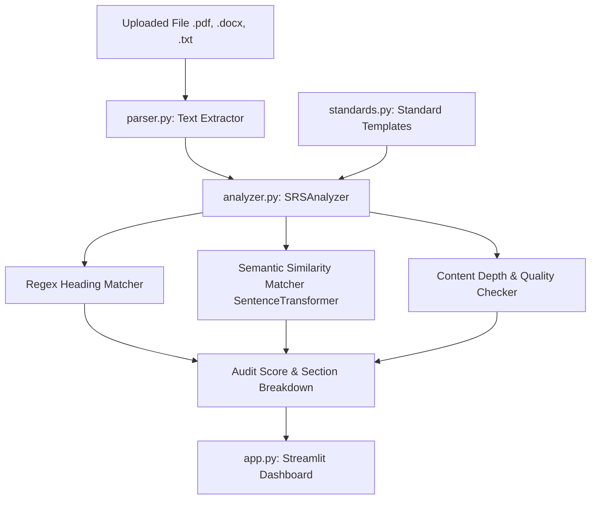

# SRS Compliance Analyzer & Auditor - Documentation

An offline compliance checker and auditor for Software Requirements Specification (SRS) documents. The tool compares your requirements document against standard industry templates: **IEEE Std 830-1998** (classic system-centric layout) and **ISO/IEC/IEEE 29148:2018** (modern requirements engineering layout).

---

## 1. Project Architecture

The application is structured into the following modules:



- **[standards.py](file:///a:/New%20project/Workshop/Agentic_AWS/SRS_Compliance_Analyzer/standards.py)**: Contains definitions, weights, priority (required vs. optional), and semantic anchors for both target standards.
- **[parser.py](file:///a:/New%20project/Workshop/Agentic_AWS/SRS_Compliance_Analyzer/parser.py)**: Handles text extraction from various formats (`.pdf` via `pypdf`, `.docx` via `python-docx`, and `.txt` via standard encoding attempts).
- **[analyzer.py](file:///a:/New%20project/Workshop/Agentic_AWS/SRS_Compliance_Analyzer/analyzer.py)**: Contains core auditing logic using strict regex heading rules, fallback semantic matching (`all-MiniLM-L6-v2`), and depth-quality evaluations.
- **[app.py](file:///a:/New%20project/Workshop/Agentic_AWS/SRS_Compliance_Analyzer/app.py)**: Renders the visual Streamlit dashboard with score meters, section tables, status badges, and action recommendations.
- **[test_analyzer.py](file:///a:/New%20project/Workshop/Agentic_AWS/SRS_Compliance_Analyzer/test_analyzer.py)**: A standalone CLI validation tool for verification.

---

## 2. Compliance Evaluation Pipeline

For each section definition in the selected standard:
1. **Regex Scan**: Evaluates the lines of the document for patterns starting with the section ID followed by the section name or keywords (e.g. `^1\.1\s+Purpose`).
2. **Semantic Similarity Fallback**: If strict header pattern match fails, it encodes all document paragraphs and compares them with the target section's semantic anchor vectors using `all-MiniLM-L6-v2` embeddings. If the cosine similarity matches or exceeds `50%`, the section is classified as **Matched**.
3. **Quality & Depth Audit**: Once a section match is found:
   - **Placeholder Scan**: Looks for words indicating templates like `TODO`, `TBD`, `Insert here`, `Placeholder`, `Lorem Ipsum`. If found, the section is flagged as **Weak**.
   - **Length Evaluation**: Counts characters in the matched section block. If less than `60` characters, the section is flagged as **Weak** (insufficient content depth).
   - **Good Content**: Otherwise, it is marked as fully **Matched**.

---

## 3. Scoring System

Each section is assigned a weight representing its importance (e.g., Introduction is `5`, References is `2`, Specific Requirements is `5`).
- **Matched Section**: Earns `100%` of its weight.
- **Weak Section**: Earns `40%` of its weight (partial credit for header-only or placeholder entries).
- **Missing Section**: Earns `0%` of its weight.

$$\text{Compliance Score} = \left( \frac{\sum \text{Earned Weights}}{\sum \text{Total Standard Weights}} \right) \times 100$$

---

## 4. How to Run

### Installation & Prerequisites
Make sure your Python dependencies are installed:
```bash
pip install -r requirements.txt
```

### Run Streamlit App Dashboard
Run the following command to boot the web interface:
```bash
streamlit run app.py
```
Open the local URL (usually `http://localhost:8501`) in your browser to upload and audit your SRS documents.

### Run CLI Test validation
Execute the test script to audit the dummy document [sample_srs.txt](file:///a:/New%20project/Workshop/Agentic_AWS/SRS_Compliance_Analyzer/sample_srs.txt):
```bash
python test_analyzer.py
```
